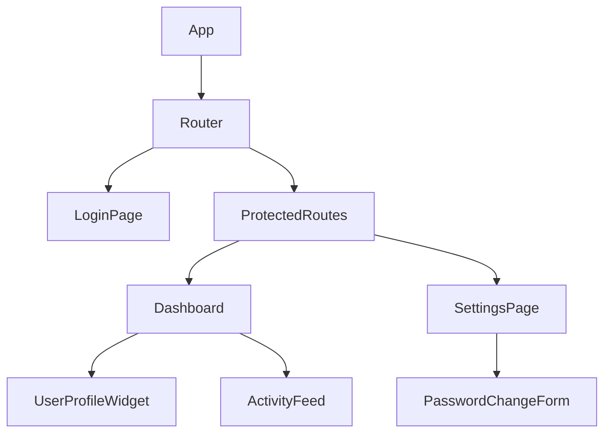
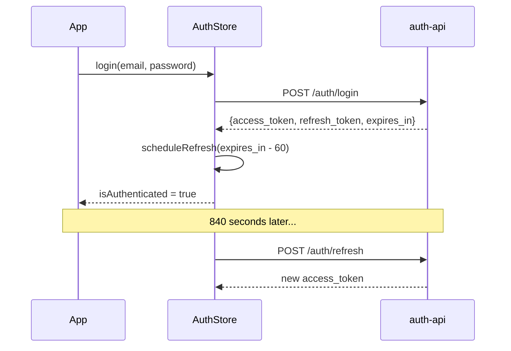

# Architecture — frontend-app

## Overview

`frontend-app` is a React 18 SPA. It is the only user-facing component in the platform.
All data is fetched from backend services — no direct database access from the browser.

## State Management

Global state is managed with **Zustand**. The auth slice holds:
- `accessToken: string | null` — in-memory only, never persisted to disk
- `user: UserProfile | null` — cached profile after login
- `refreshing: boolean` — prevents concurrent refresh calls

## Component Tree

## Token Lifecycle

Access tokens last 900 seconds. The frontend schedules a silent refresh 60 seconds
before expiry using `setTimeout`. If the refresh fails, the user is logged out immediately.

## API Integration

All Axios requests are configured with an interceptor that:
1. Attaches the Bearer token from the Zustand auth store.
2. On 401 response, triggers the refresh flow once before retrying.
3. On second 401 (refresh failed), dispatches `logout()`.

## Business Rules

1. Access tokens must be stored in memory only — no `localStorage` or `sessionStorage`.
2. The refresh token cookie must be `httpOnly` and `SameSite=Strict`.
3. On logout, call `DELETE /auth/logout` even if the UI token is already expired.
4. Protected routes must redirect to `/login?next=<path>` preserving the intended destination.
