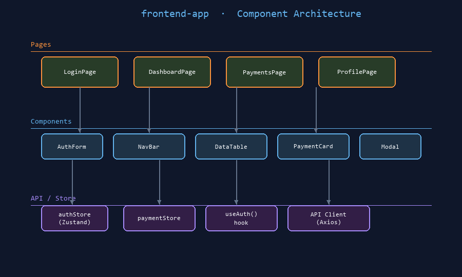

# frontend-app

A React single-page application that provides the customer-facing UI for the platform.
It consumes `auth-api` for authentication and `user-api` for profile data.


## Architecture Diagram



*React component layers: Pages → Components → Stores/API client*

## Purpose

`frontend-app` is the primary web UI. It handles login, session management, user profile,
dashboard, and navigation to product features. Downstream of `auth-api` and `user-api`.

## Technology Stack

- **React 18** with TypeScript
- **React Router v6** for client-side routing
- **Axios** for HTTP requests
- **Zustand** for global auth state
- **Vitest + Testing Library** for unit and integration tests
- **Playwright** for end-to-end page object tests

## Architecture

```mermaid
flowchart LR
    Browser --> LoginPage
    LoginPage -->|POST /auth/login| auth-api
    auth-api -->|TokenPair| LoginPage
    LoginPage -->|Store tokens| Zustand
    Dashboard -->|GET /users/{id}| auth-api
    Dashboard -->|Render profile| UserProfileWidget
    subgraph Pages
        LoginPage
        Dashboard
        SettingsPage
    end
```

## Pages and Routes

| Route | Component | Auth Required |
|-------|-----------|--------------|
| /login | LoginPage | No |
| /dashboard | Dashboard | Yes |
| /settings | SettingsPage | Yes |

## Business Rules

- Redirect unauthenticated users to /login from any protected route.
- Store access token in memory only — never in localStorage.
- Store refresh token in an httpOnly cookie set by auth-api.
- Auto-refresh the access token 60 seconds before it expires.
- On refresh failure (401), clear state and redirect to /login.

## Team

Team: frontend | Component type: ui | Language: TypeScript

## Running

```bash
npm install
npm run dev
```

## Testing

```bash
npm test          # Vitest unit tests
npx playwright test  # E2E page object tests
```
